## Nuestra empresa

Somos Dataminds Consultora, una empresa especializada en desbloquear el potencial de los datos a través de análisis avanzados y soluciones basadas en inteligencia artificial. Contamos con un equipo multidisciplinario compuesto por expertos en ingeniería de datos, análisis de datos y ciencia de datos.
## Equipo de proyecto

- Data Engineer: Ernesto Carrillo
- Data Engineer: Jhon Curi
- Data Analyst: Juan Arevalo
- Data Scientist: Mauro Pimentel

## Descripción del proyecto "Esperanza de Vida"

El proyecto tiene como objetivo principal estudiar las diferencias en la esperanza de vida entre países y grupos de población, identificando los factores que contribuyen a estas diferencias y proporcionando recomendaciones basadas en el análisis de datos. El proyecto se basa en la premisa de que la esperanza de vida es un indicador clave de desarrollo humano y bienestar y que comprender los factores que influyen en ella es fundamental para promover la equidad y mejorar la calidad de vida de las personas en todo el mundo. Utilizaremos técnicas avanzadas de análisis de datos y visualización para explorar las tendencias a lo largo del tiempo, identificar correlaciones entre indicadores clave y presentar recomendaciones basadas en los hallazgos.

##Selección de países
En nuestro proyecto de esperanza de vida, hemos realizado una cuidadosa selección de países que representan diferentes niveles de desarrollo y esperanza de vida. Esta selección nos permitirá analizar las disparidades y determinantes de la esperanza de vida en diferentes contextos socioeconómicos. Hemos clasificado los países en tres categorías: países desarrollados, países con esperanza de vida media y países con esperanza de vida baja.
Esta selección de países nos permitirá obtener una perspectiva amplia y representativa de la esperanza de vida a nivel mundial, considerando diferentes niveles de desarrollo, contextos socioeconómicos y de salud.

  ![]

##DATA ENGINEERING
La etapa de Data Engineering en el proyecto "Esperanza de Vida" se encarga de procesar, transformar y preparar los datos necesarios para su posterior análisis y modelado. A continuación, se describen las principales tareas realizadas durante esta etapa:
###ETL
**Extracción:** En esta etapa, se obtienen los datos relevantes para el análisis de esperanza de vida desde diferentes fuentes de datos, como bases de datos, archivos CSV, APIs u otras fuentes externas. La extracción implica identificar y seleccionar los datos necesarios para el análisis de esperanza de vida, ya sea datos demográficos, indicadores de salud, factores socioeconómicos u otros datos relevantes.

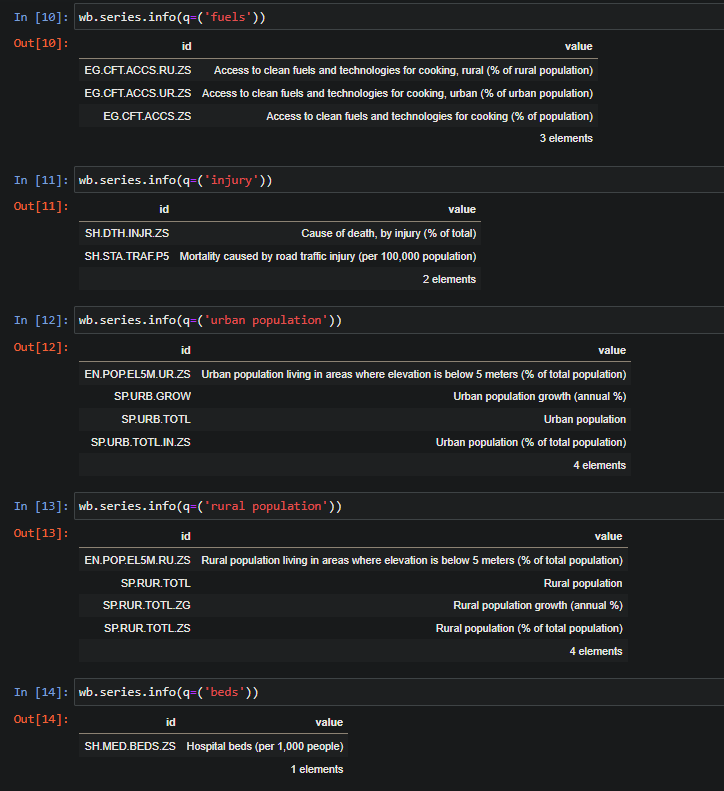

**Transformación:** Una vez que los datos se han extraído, se aplican una serie de transformaciones para limpiar, integrar y preparar los datos de manera adecuada para el análisis. Esto puede incluir tareas como la eliminación de datos duplicados, la corrección de valores faltantes o erróneos, la normalización de datos, la conversión de tipos de datos y la agregación de datos en niveles adecuados de granularidad.

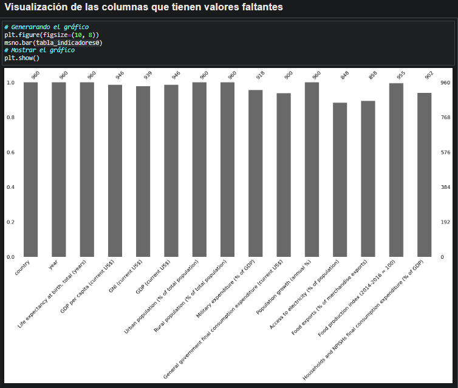

Se aplican técnicas de procesamiento para transformar los datos en un formato adecuado para su análisis posterior. Esto puede incluir la conversión de datos categóricos a numéricos, la normalización de valores, la generación de variables derivadas, entre otros.

 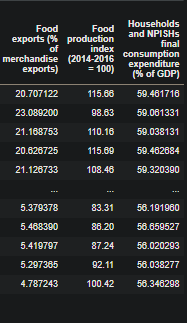

###Control de calidad:
Se realizan pruebas y validaciones para garantizar la calidad de los datos procesados. Esto implica la detección y corrección de posibles errores o inconsistencias

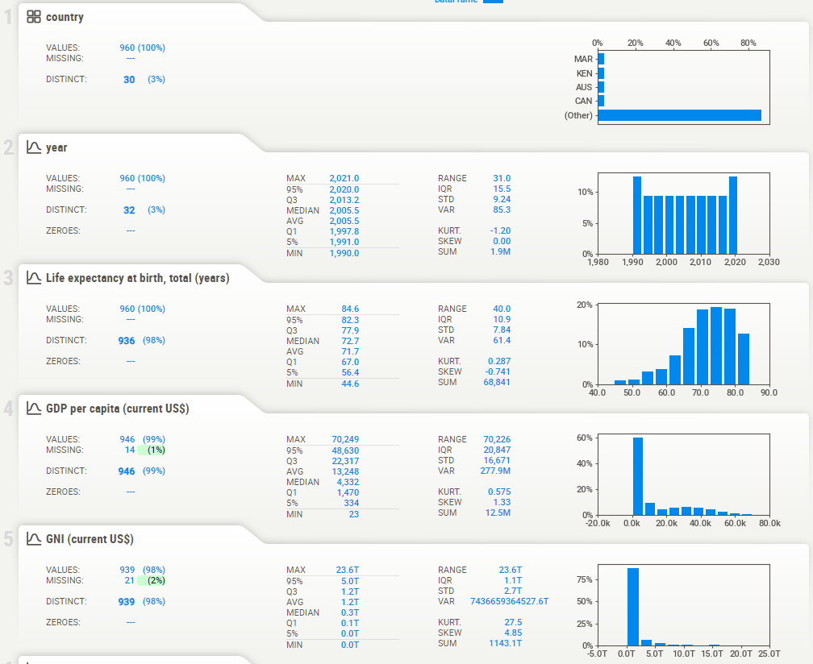
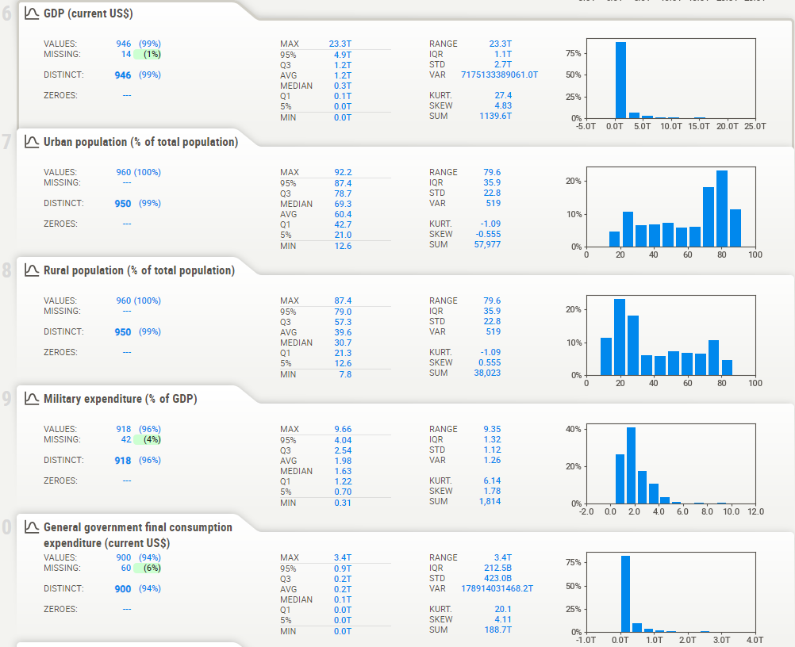
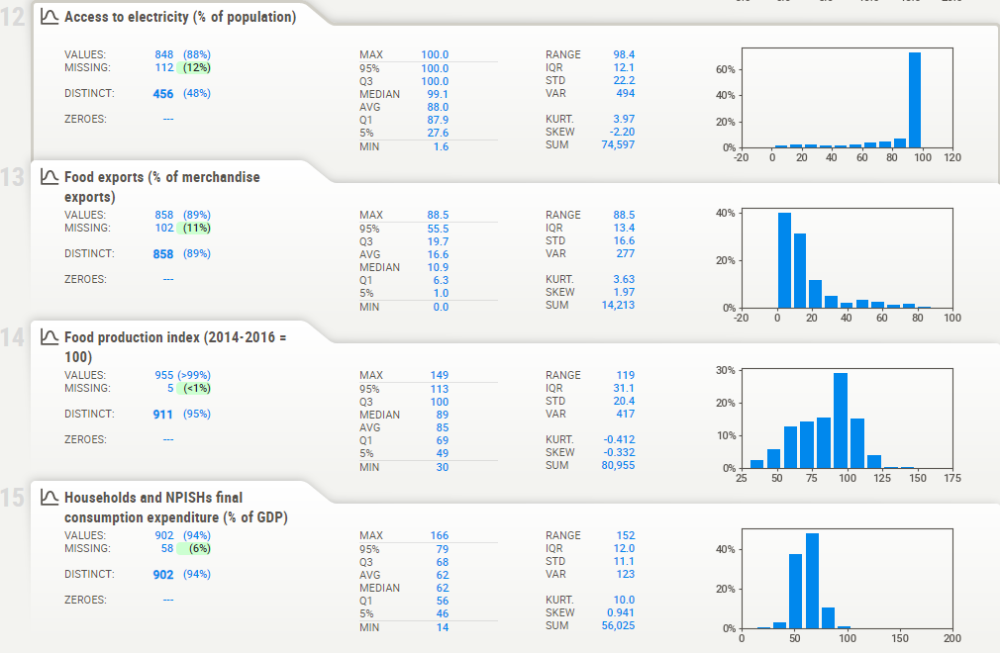

####EDA
El EDA en el proyecto de predicción de esperanza de vida implica explorar y analizar los datos de manera exhaustiva para comprender su estructura, características y relaciones. Esto proporciona una base sólida para la construcción de modelos predictivos y la toma de decisiones informadas.

###Análisis descriptivo: 
Se realiza un resumen estadístico de las variables relevantes. Se exploran medidas como la media, la mediana, la desviación estándar, los valores mínimos y máximos, y se identifican posibles valores atípicos o datos faltantes.

###Visualización de datos: 
Se utilizan gráficos y diagramas para representar visualmente los datos. Algunas visualizaciones útiles pueden incluir histogramas para analizar la distribución de la esperanza de vida.

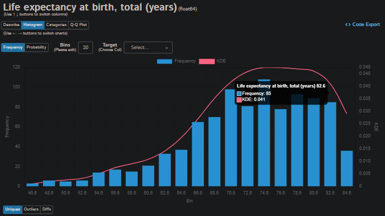

###Análisis de correlación: 
Se calculan las correlaciones entre las variables para identificar posibles relaciones lineales o no lineales. Esto puede ayudar a determinar qué variables pueden ser más relevantes para predecir la esperanza de vida y cómo se relacionan entre sí.

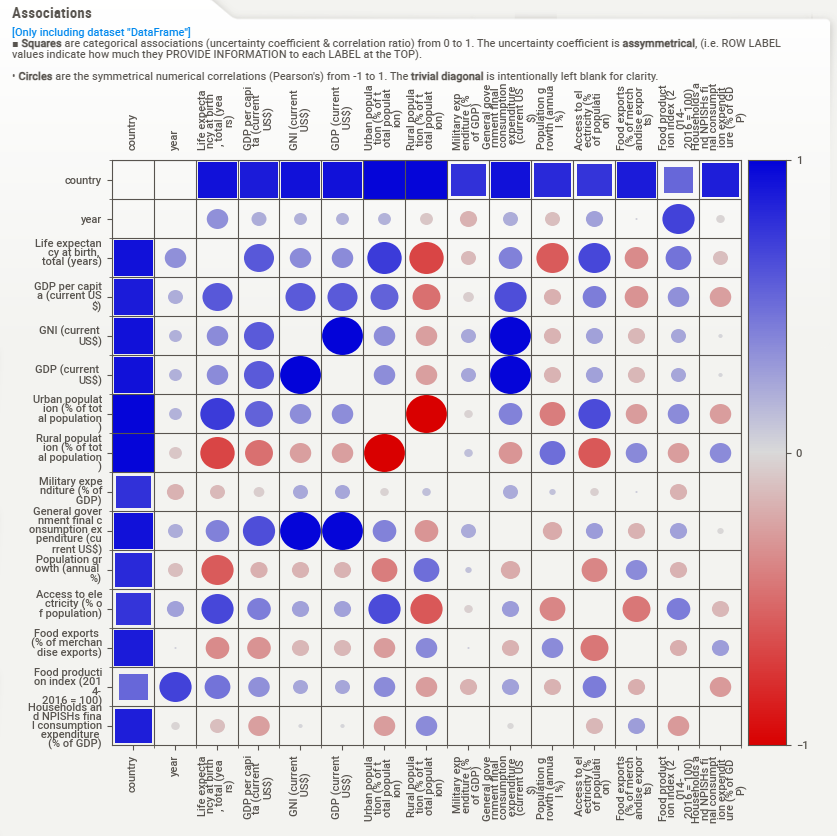

###Tratamiento de datos faltantes o inconsistentes: 
Se detectan y manejan los datos faltantes o inconsistentes en el conjunto de datos. Esto puede implicar técnicas como imputación de datos faltantes.

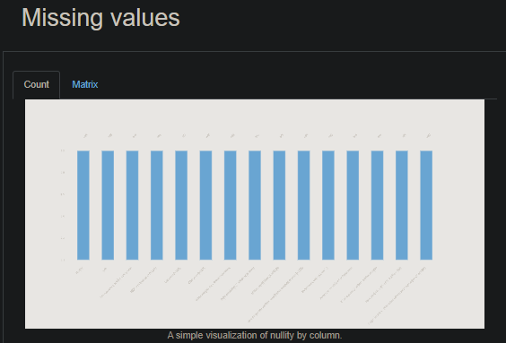

###Identificación de valores atípicos: 
Se buscan valores extremos o atípicos que puedan afectar el análisis o la construcción del modelo. Se pueden utilizar técnicas como el diagrama de caja (box plot) o los métodos estadísticos para identificar y manejar estos valores atípicos

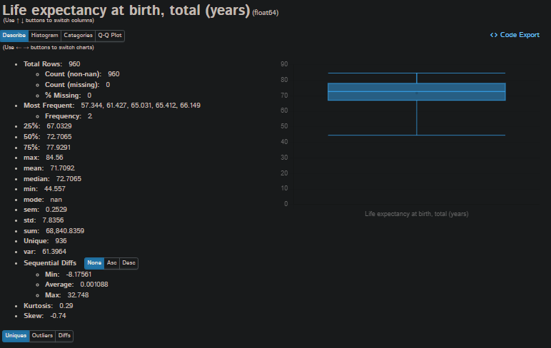

###Análisis de distribuciones: 
Se examinan las distribuciones de las variables para comprender su forma y propiedades estadísticas. Esto puede ayudar a elegir el enfoque adecuado para el modelado y la transformación de variables si es necesario.

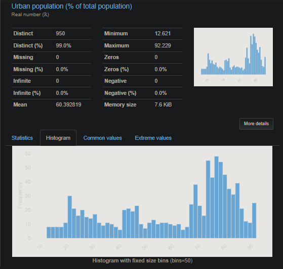

###Análisis de relaciones y tendencias: 
Se investigan las relaciones entre las variables y se buscan posibles tendencias o patrones a lo largo del tiempo o entre diferentes grupos. Esto puede ayudar a identificar factores que puedan influir en la esperanza de vida.

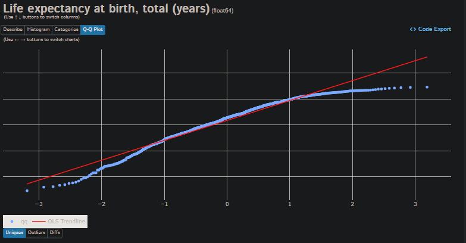

## DATA ANALYST
Utilizamos técnicas y herramientas de análisis de datos para extraer información significativa y realizar informes y visualizaciones que ayuden a comprender los factores que influyen en la esperanza de vida. Su objetivo es identificar patrones, tendencias y relaciones en los datos para proporcionar conocimientos valiosos que respalden la toma de decisiones y las estrategias de mejora en la esperanza de vida.

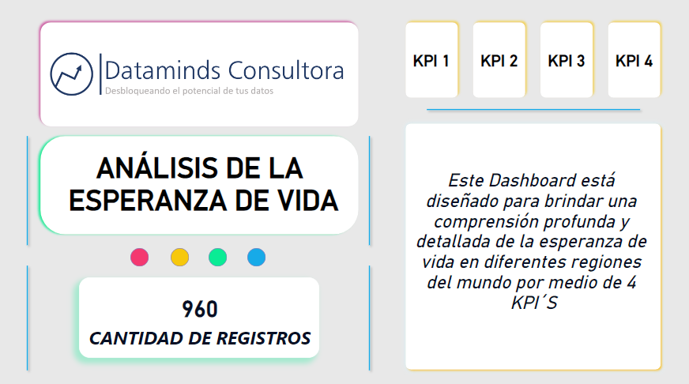

**KPI 1 - GDP per capita (current US$):**
Este indicador muestra el Producto Interno Bruto (PIB) per cápita de un país en dólares estadounidenses actuales. Representa la medida promedio de la producción económica por persona y se utiliza para evaluar el nivel de desarrollo económico y el nivel de vida en un país.

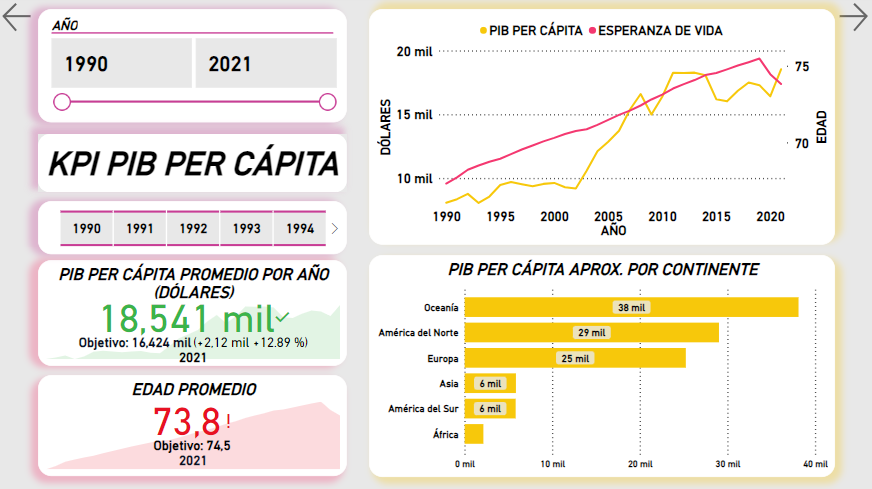

**KPI 2 - Urban population (% of total population) y Rural population (% of total population):**
Estos indicadores representan el porcentaje de la población total de un país que vive en áreas urbanas y rurales, respectivamente. La población urbana se refiere a las personas que viven en áreas urbanizadas, como ciudades y zonas metropolitanas, mientras que la población rural se refiere a las personas que viven en áreas no urbanizadas, como pueblos y áreas agrícolas. Estos indicadores son importantes para comprender la distribución geográfica de la población y el nivel de urbanización en un país.

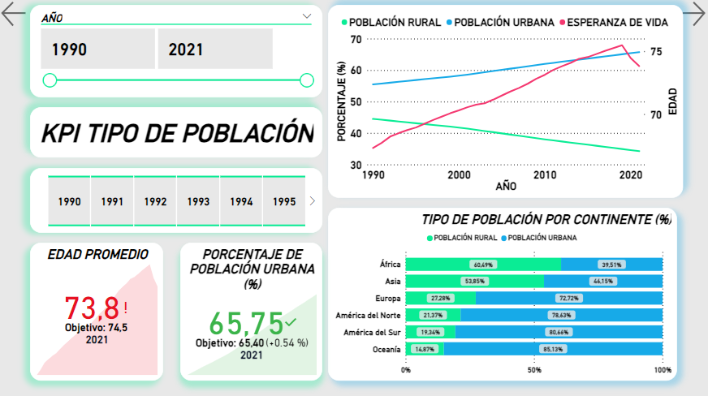

**KPI 3 - Military expenditure (% of GDP):**
Este indicador muestra el porcentaje del gasto público destinado a gastos militares en relación con el PIB de un país. Representa la proporción del gasto económico que se destina a actividades militares, como defensa y seguridad nacional. Este indicador es relevante para evaluar la importancia relativa que un país asigna a sus gastos militares en comparación con su economía general.

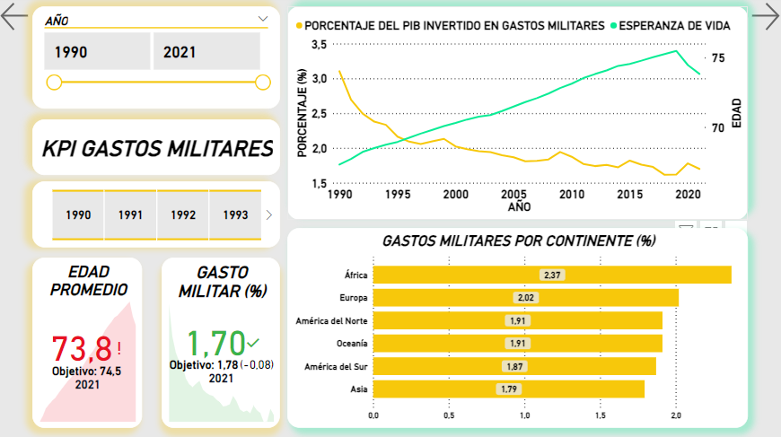

**KPI 4 - General government final consumption expenditure (current US$):**
Este indicador representa el gasto de consumo final del gobierno general en dólares estadounidenses actuales. Incluye los gastos del gobierno en bienes y servicios destinados al consumo final, como educación, salud, infraestructura y servicios públicos. Este indicador es importante para evaluar el tamaño y la importancia del sector público en la economía, así como el nivel de inversión del gobierno en el bienestar y el desarrollo del país.

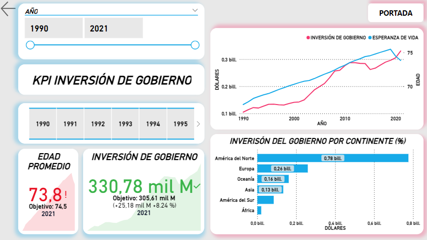

##MACHINE LEARNING

La implementación del modelo de Machine Learning en el proyecto de esperanza de vida implica la recopilación y preparación de datos, selección de características, entrenamiento y evaluación del modelo utilizando el algoritmo de Random Forest, validación cruzada, y finalmente, la implementación del modelo para generar predicciones y obtener insights significativos sobre la esperanza de vida.

**División de datos en entrenamiento y prueba:** 
Los datos se dividen en dos conjuntos: uno para entrenar el modelo y otro para evaluar su rendimiento. Usualmente, se utiliza el 80% de los datos para entrenamiento y el 20% restante para prueba.

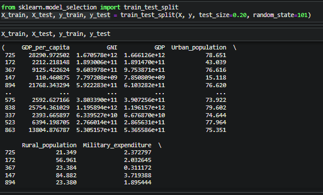

**Selección del algoritmo adecuado:**
En este caso, se utiliza el algoritmo de Random Forest, que es un algoritmo de aprendizaje supervisado utilizado para problemas de regresión. Random Forest se elige debido a su capacidad para manejar múltiples variables predictoras y su capacidad para capturar relaciones no lineales en los datos.

**Entrenamiento del modelo:** 
Se entrena el modelo utilizando los datos de entrenamiento, donde se ajustan los parámetros del algoritmo de Random Forest para que se ajusten a los datos y aprendan la relación entre las características y la variable objetivo, que en este caso es la esperanza de vida.

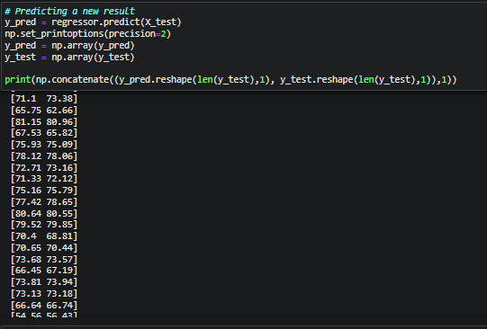

**Evaluación y ajuste del modelo:**
Se evalúa el rendimiento del modelo utilizando los datos de prueba. Se calculan métricas de evaluación como el coeficiente de determinación (R^2) para medir la calidad de las predicciones. Si es necesario, se realizan ajustes en los parámetros del modelo para mejorar su rendimiento.

**Validación:**
Se realiza una validación cruzada del modelo para obtener una estimación más precisa del rendimiento utilizando diferentes particiones de los datos de entrenamiento y prueba.

**Implementación:**
Una vez que el modelo ha sido entrenado y evaluado satisfactoriamente, se implementa en un entorno de producción. Esto implica utilizar el modelo entrenado para realizar predicciones en nuevos conjuntos de datos y generar insights relevantes sobre la esperanza de vida en función de las variables predictoras

Se carga el modelo de manera que el modelo se pueda utilizar sin necesidad de entrenarlo nuevamente. Se calcula el coeficiente de determinación (R^2) del modelo cargado utilizando los datos de prueba, para asegurar de que el modelo cargado funciona correctamente. Se imprime el coeficiente de determinación (R^2) del modelo cargado.

El desarrollo y el despliegue de aplicaciones de aprendizaje automático (ML), el SDK de una plataforma de nube, como el SDK de Google Cloud Platform (GCP), proporciona las herramientas y bibliotecas necesarias para interactuar con los servicios de la plataforma y desarrollar, entrenar y desplegar modelos de ML.

### Link del deploy: 
https://esperanzadevida-data10.uc.r.appspot.com/

### AUTOMATIZACIÓN DEL PROYECTO
La automatización del pipeline en el proyecto de esperanza de vida se refiere a la creación de un flujo de trabajo automatizado que incluye todas las etapas del proceso, desde la recopilación y preparación de datos hasta la implementación y evaluación del modelo de predicción.

En este contexto, el pipeline automatizado puede comprender las siguientes etapas:

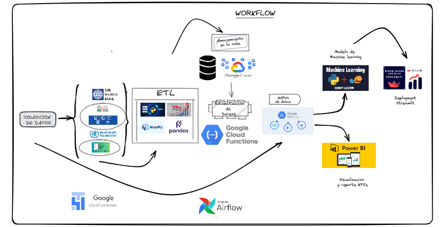

**Contribución**
Se agradece cualquier contribución al proyecto. Si desea colaborar, siga los siguientes pasos:
1. Realice un fork del repositorio.
2. Cree una rama para su nueva funcionalidad o corrección de errores.
3. Realice los cambios necesarios y documento apropiadamente.
4. Envíe una pull request para revisar los cambios propuestos.

**Equipo**
El proyecto "Esperanza de Vida" ha sido desarrollado por el equipo de científicos de datos y analistas de Dataminds Consultora para los directivos del PNUD. Cada miembro del equipo ha contribuido con su experiencia y conocimientos en el análisis de datos, machine learning y presentación de informes.

**Contacto**
Para obtener más información sobre el proyecto "Esperanza de Vida" o para realizar consultas adicionales, puede contactarnos a través de los siguientes canales:
- Correo electrónico: project-team@datamind.com
- Teléfono: +51 123 456 789  +57 123 456 789

Estamos disponibles para responder cualquier pregunta o inquietud que pueda tener.
